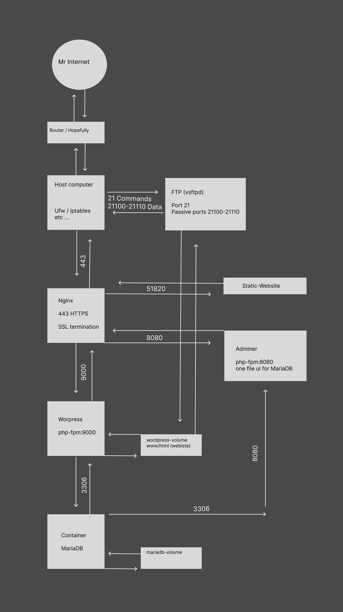

## Inception Project

## Overview

This project demonstrates a multi-container Docker setup for serving a WordPress website with improved performance and management capabilities. Key components include Nginx, WordPress, Redis, MariaDB, an FTP server, and Adminer.

## Components

1. **Nginx (SSL Termination and Reverse Proxy):**
   - Listens on port 443 (HTTPS) and handles SSL termination.
   - Proxies requests to the appropriate backend services within the Docker network.

2. **WordPress (PHP-FPM):**
   - Runs the WordPress site and handles PHP processing.
   - Uses PHP-FPM to process PHP files.
   - Volume attached to the host for persistent storage.

3. **Redis (Caching):**
   - Acts as a caching layer to reduce database queries and improve performance.
   - Stores frequently accessed data for quick retrieval.

4. **MariaDB (Database):**
   - Serves as the database for the WordPress site.
   - Volume attached to the host for persistent storage.

5. **FTP Server:**
   - Allows modification of WordPress website files.
   - Runs on localhost:21 and uses passive ports 21100-21110.
   - Volume attached to the host for persistent storage.

6. **Adminer:**
   - A lightweight web-based database management tool.
   - Provides an interface to manage the MariaDB database.
   - Accessible through the Nginx reverse proxy.

7. **Static Website:**
   - Serves static content from a dedicated container.
   - Handled by Nginx for serving static assets efficiently.

## Usage

### Check Redis Keys
To verify that Redis is being used and storing keys:
```bash
docker exec -it wordpress-redis redis-cli
KEYS *
```
### Tell you host to trust your self signed certs.
```bash
sudo docker cp nginx:/etc/ssl/certs/nginx-selfsigned.crt  /usr/local/share/ca-certificates/selfsigned.crt
sudo update-ca-certificates
```
### Messy pic but you get the point :D
